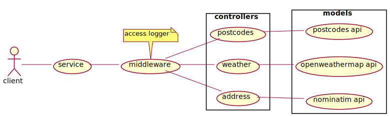

# A Millions Ads Backend Tech Test

## Diagrams (plantuml)



## Folder Architecture

```
.
├── config
│   ├── default.json
│   └── test.json
├── diagrams
│   ├── usecase.svg
│   └── usecase.txt
├── index.js
├── jest.config.js
├── package.json
├── package-lock.json
├── README.md
├── sh_get.sh
├── src
│   ├── controllers
│   │   ├── getAddress.ts
│   │   ├── getPostcodes.ts
│   │   ├── getWeatherForecast.ts
│   │   └── index.ts
│   ├── main.ts
│   ├── middlewares
│   │   ├── accessLogger.ts
│   │   ├── index.ts
│   │   └── trafficeHandler.ts
│   ├── models
│   │   ├── index.ts
│   │   ├── nominatimApi.ts
│   │   ├── openweathermapApi.ts
│   │   └── postcodesApi.ts
│   └── utilities
│       └── logger.ts
├── __tests__
│   └── spec.js
├── tmp.txt
├── _TODOLIST.txt
└── tsconfig.json
```

## Routes

### Postcode

`GET /postcodes/{postcode}`
This route will return the latitude and longitude based on the postcode provided as a request parameter.

Will return a 404 http status code if not found.

Example:
```
GET /postcodes/SE166RZ

{"postcode":"SE166RZ","latitude":51.500521,"longitude":-0.044641}
```

### Postcode**S**

`GET /postcodes/{postcode},{postcode},...`
This route will return an array of object containing the latitudes and longitudes based on the postcodes provided as a request parameter (the retunred object also embed the imputed postcodes to allow an easy match with what was provided).

Will return a 404 http status code if not found.

Example:
```
GET /postcodes/SE166RZ,SE166RZ,SE166RZ

[{"postcode":"SE166RZ","latitude":51.500521,"longitude":-0.044641},{"postcode":"SE166RZ","latitude":51.500521,"longitude":-0.044641},{"postcode":"SE166RZ","latitude":51.500521,"longitude":-0.044641}]
```

### Weather

`GET /weather/?latitude=...&longitude=...`
This route will return the weather data based on the latitude and longitude provided as a request parameter.

Will return a 404 http status code if not found.

Example:
```
GET /weather/?latitude=51.500521&longitude=-0.044641

{"coord":{"lon":-0.0446,"lat":51.5005},"weather":[{"id":803,"main":"Clouds","description":"broken clouds","icon":"04n"}],"base":"stations","main":{"temp":3.83,"feels_like":-2.18,"temp_min":3.33,"temp_max":4.44,"pressure":1022,"humidity":60},"visibility":10000,"wind":{"speed":5.14,"deg":160},"clouds":{"all":75},"dt":1613331289,"sys":{"type":1,"id":1414,"country":"GB","sunrise":1613286958,"sunset":1613322778},"timezone":0,"id":2640091,"name":"Poplar","cod":200}
```

### Address

`GET /address/?latitude=...&longitude=...`
This route will return the location data based on the latitude and longitude provided as a request parameter.

Will return a 404 http status code if not found.

Example:
```
GET /address/?latitude=51.500521&longitude=-0.044641

{"place_id":112424100,"licence":"Data © OpenStreetMap contributors, ODbL 1.0. https://osm.org/copyright","osm_type":"way","osm_id":100879306,"lat":"51.500606843390784","lon":"-0.04471302324881442","display_name":"Middleton Drive, Canada Water, Rotherhithe, London Borough of Southwark, London, Greater London, England, SE16 6RZ, United Kingdom","address":{"road":"Middleton Drive","quarter":"Canada Water","suburb":"Rotherhithe","city_district":"London Borough of Southwark","city":"London","state_district":"Greater London","state":"England","postcode":"SE16 6RZ","country":"United Kingdom","country_code":"gb"},"boundingbox":["51.5004842","51.5008498","-0.0448592","-0.0443099"]}
```

---

# initial stuff provided

This is a simple skeleton api dealing with data on postcode inputs. We've provided this knowing your time is precious, and we strongly suggest that you use this as your starting point, and complete as much as you can within the agreed time limit. However you may set up the project differently and/or use a different language or framework if you feel that helps to display your skills better.

## Your task is:
1. Create an endpoint that takes a single postcode and returns the latitude and longitude.
2. Create another endpoint (or extend the one in step 1) to take a set of postcodes and return the relevant latitude and longitude for each.
3. Still got time left? extend further by returning more useful data about the location, e.g. weather

Please complete as much of the task as you can in a 2 hour timeframe. We're not expecting you to return a completely finished project, but you should be prepared to talk about the choices you've made. We'd like to see your Git commit history to understand how you've built up your solution, so please be sure to make commits as you go along.

## Installation
Fork or clone this repo and run `npm install` to get started.

## Getting Started
`npm run dev` will give you a live updating server<br/>
`npm run build` will compile down to ES5 into the `dist` folder<br/>
`npm run start` will serve the compiled code<br/>
`npm run test` will run tests<br/>

You might notice that we've included support for TypeScript in this project - we'd love to see you use TypeScript if you're familiar with it already. If you're not, we'd much rather see what you can do with JS than expect you to learn a new technology in the next 2 hours. Either way you can use the live updating server and test setup we've provided.

## Suggested Resources
Feel free to use any of the below if you find them helpful:
- https://postcodes.io
- https://openweathermap.org/api
- https://postman.com
- [Latitude and Longitude - Wikipedia](https://en.wikipedia.org/wiki/Geographic_coordinate_system#Latitude_and_longitude)